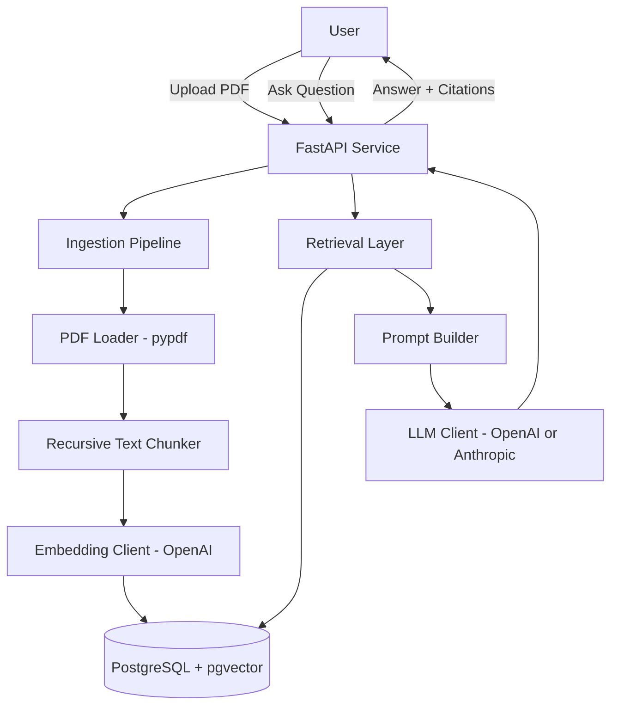

# PDF RAG Knowledge Assistant


A Retrieval-Augmented Generation (RAG) chatbot API that answers questions grounded
in your own PDF documents — with citations, no hallucinated sources, and a
provider-agnostic LLM layer (OpenAI or Anthropic).

> **Status:** MVP / Development. Core pipeline (ingest → chunk → embed → retrieve →
> generate) is implemented and tested. Not yet deployed to a public URL.
> See [Project Maturity](#project-maturity).

## Table of Contents

- [Project Overview](#project-overview)
- [Business Problem](#business-problem)
- [Solution](#solution)
- [Key Features](#key-features)
- [Use Cases](#use-cases)
- [System Architecture](#system-architecture)
- [Workflow](#workflow)
- [Tech Stack](#tech-stack)
- [Project Structure](#project-structure)
- [Installation](#installation)
- [Prerequisites](#prerequisites)
- [Environment Variables](#environment-variables)
- [API Documentation](#api-documentation)
- [AI Architecture](#ai-architecture)
- [RAG Architecture](#rag-architecture)
- [Database Design](#database-design)
- [Screenshots](#screenshots)
- [Demo Video](#demo-video)
- [Live Demo](#live-demo)
- [Testing](#testing)
- [Security](#security)
- [Error Handling](#error-handling)
- [Monitoring & Observability](#monitoring--observability)
- [Cost Considerations](#cost-considerations)
- [Limitations](#limitations)
- [Future Improvements](#future-improvements)
- [Troubleshooting](#troubleshooting)
- [Project Maturity](#project-maturity)
- [Author](#author)
- [License](#license)

## Project Overview

PDF RAG Knowledge Assistant is a backend API that lets a user upload PDF
documents and then ask natural-language questions about their contents. Answers
are generated only from retrieved passages of the uploaded documents, with
inline citations to the source file and page number — reducing hallucination
risk compared to asking an LLM directly.

It exists to demonstrate a production-shaped implementation of the RAG pattern:
proper chunking strategy, a real vector database (not an in-memory list), a
provider-agnostic generation layer, structured error handling, and a tested,
documented API — rather than a single-notebook demo.

## Business Problem

Teams and individuals accumulate large volumes of PDF knowledge — contracts,
manuals, research papers, internal policies — that are slow to search manually
and too large to paste into a chat window. Generic LLM chat tools either can't
access these private documents or, when documents are pasted in, produce
answers with no verifiable source.

## Solution

The assistant ingests PDFs into a vector database, retrieves only the most
relevant passages for a given question, and constrains the LLM to answer using
that retrieved context — with every claim traceable to a specific file and page.

## Key Features

- PDF upload and text extraction (multi-page, with per-page failure isolation)
- Semantic chunking with configurable size/overlap to preserve context across boundaries
- Embedding generation and storage in PostgreSQL + pgvector
- Similarity-search retrieval with a configurable relevance threshold
- Grounded answer generation with `[source_file, p.N]` citations
- Provider-agnostic LLM layer (OpenAI or Anthropic, switchable via config)
- API key authentication, per-IP rate limiting, and upload size limits
- Structured JSON logging for observability
- Full unit + integration + (optional) end-to-end test suite
- Dockerized for one-command local startup (API + PostgreSQL/pgvector)

## Use Cases

- **Internal knowledge base** — employees ask questions against policy/handbook PDFs.
- **Contract review assistant** — quickly locate clauses across long legal PDFs with page-level citations.
- **Research assistant** — query a folder of academic papers for specific findings.
- **Customer support** — ground support responses in product manuals instead of free-form LLM guesses.

## System Architecture



## Workflow

```text
PDF Upload
   ↓
Text Extraction (per page)
   ↓
Chunking (recursive, overlap-preserving)
   ↓
Embedding Generation
   ↓
Vector Store (PostgreSQL + pgvector)
   ↓
[User asks a question]
   ↓
Similarity Search (top-k retrieval)
   ↓
Grounded Prompt Construction
   ↓
LLM Generation (OpenAI / Anthropic)
   ↓
Answer + Citations returned to user
```

## Detailed Workflow

1. **Upload** — `POST /documents/upload` accepts a PDF, streamed to disk with a size cap.
2. **Extraction** — `pdf_loader.py` extracts text per page via `pypdf`; pages with no
   extractable text (e.g. scanned images) are logged and skipped, not silently dropped.
3. **Chunking** — `chunker.py` uses LangChain's `RecursiveCharacterTextSplitter` to split
   text on paragraph → sentence → word boundaries, with overlap to avoid losing
   context that spans a chunk boundary.
4. **Embedding** — each chunk is embedded via OpenAI's `text-embedding-3-small`.
5. **Storage** — chunks + metadata (source file, page number) are stored in
   PostgreSQL via the `pgvector` extension.
6. **Retrieval** — `POST /chat/ask` embeds the question and runs similarity search
   to fetch the top-k most relevant chunks above a relevance threshold.
7. **Generation** — retrieved chunks are assembled into a grounded prompt and sent
   to the configured LLM, instructed to cite sources and refuse to answer beyond
   the given context.
8. **Response** — the API returns the answer plus a structured list of citations
   (file, page, relevance score).

## Tech Stack

| Category | Technologies |
|---|---|
| Language | Python 3.12 |
| Backend | FastAPI, Pydantic, Uvicorn |
| AI | OpenAI (embeddings + chat), Anthropic Claude (chat) |
| AI Engineering | LangChain, RAG, semantic chunking, tool-agnostic prompt design |
| Database | PostgreSQL + pgvector |
| DevOps | Docker, Docker Compose, GitHub Actions CI |
| Security | API key auth, rate limiting, input validation |
| Monitoring | structlog (structured JSON logs) |
| Testing | pytest, httpx, pytest-cov |

## Project Structure

```text
pdf-rag-knowledge-assistant/
│
├── README.md
├── LICENSE
├── .gitignore
├── .env.example
├── CONTRIBUTING.md
├── CHANGELOG.md
├── Dockerfile
├── docker-compose.yml
├── requirements.txt
├── pyproject.toml
│
├── docs/                      # Architecture, API, security, deployment docs
│   └── screenshots/
│
├── src/pdf_rag/
│   ├── main.py                 # FastAPI app, middleware, exception handlers
│   ├── config.py                # Environment-driven settings (pydantic-settings)
│   ├── core/                   # Logging, custom exceptions
│   ├── ingestion/               # PDF loading, chunking, ingestion pipeline
│   ├── embeddings/               # Embedding client factory
│   ├── vectorstore/               # pgvector integration
│   ├── retrieval/                # Similarity search / retriever
│   ├── generation/               # Prompt builder + LLM client (OpenAI/Anthropic)
│   └── api/routes/                # /documents and /chat endpoints
│
├── tests/
│   ├── unit/                   # Chunking, prompt building, loader errors
│   ├── integration/              # API endpoints (mocked retrieval/generation)
│   └── e2e/                    # Real DB + real LLM roundtrip (opt-in)
│
├── scripts/ingest_cli.py         # Standalone CLI ingestion tool
├── prompts/                    # System + answer prompt templates
├── config/                     # Reserved for non-secret config files
├── examples/                   # Reserved for example requests/notebooks
├── docker/                     # Reserved for auxiliary Docker assets
└── .github/workflows/ci.yml       # Lint, test, Docker build
```

## Installation

```bash
# 1. Clone the repository
git clone https://github.com/sohaggain/pdf-rag-knowledge-assistant.git
cd pdf-rag-knowledge-assistant

# 2. Create a virtual environment
python -m venv venv
source venv/bin/activate        # Windows: venv\Scripts\activate

# 3. Install dependencies
pip install -r requirements.txt

# 4. Configure environment variables
cp .env.example .env
# Edit .env and add your OPENAI_API_KEY (and/or ANTHROPIC_API_KEY)

# 5. Start PostgreSQL with pgvector (Docker)
docker compose up -d postgres

# 6. Run the API
PYTHONPATH=src uvicorn pdf_rag.main:app --reload --app-dir src
```

The API is now available at `http://localhost:8000`, with interactive docs at
`http://localhost:8000/docs`.

### Fully containerized alternative

```bash
docker compose up --build
```

## Prerequisites

- Python 3.12+
- Docker + Docker Compose (for PostgreSQL/pgvector, or full containerized run)
- An OpenAI API key (required for embeddings; required for chat if using OpenAI)
- An Anthropic API key (optional, only if `PRIMARY_LLM_PROVIDER=anthropic`)

## Environment Variables

See [`.env.example`](.env.example) for the full list. Key variables:

| Variable | Purpose |
|---|---|
| `PRIMARY_LLM_PROVIDER` | `openai` or `anthropic` — selects the generation model |
| `OPENAI_API_KEY` | Required for embeddings; required for chat if provider is `openai` |
| `ANTHROPIC_API_KEY` | Required only if provider is `anthropic` |
| `DATABASE_URL` | PostgreSQL connection string (must have `vector` extension) |
| `CHUNK_SIZE` / `CHUNK_OVERLAP` | Tune chunking granularity |
| `RETRIEVAL_TOP_K` | Number of chunks retrieved per question |
| `API_KEY` | Optional shared-secret key required in `X-API-Key` header |
| `MAX_UPLOAD_SIZE_MB` | Hard limit on PDF upload size |
| `RATE_LIMIT_PER_MINUTE` | Per-IP request cap |

Never commit a real `.env` file — it is excluded via `.gitignore`.

## API Documentation

FastAPI generates interactive OpenAPI/Swagger docs automatically at `/docs`
and ReDoc at `/redoc`. Summary of the two core endpoints:

### `POST /documents/upload`

| | |
|---|---|
| Method | `POST` |
| Auth | `X-API-Key` header (if `API_KEY` is configured) |
| Body | `multipart/form-data`, field `file` (PDF only, ≤ `MAX_UPLOAD_SIZE_MB`) |

**Example response (200):**
```json
{
  "file": "employee_handbook.pdf",
  "pages_processed": 42,
  "chunks_created": 118
}
```

**Error responses:** `400` (invalid/unsupported file, extraction failure),
`413`-equivalent via `FileTooLargeError` → `400`, `401` (missing/invalid API key).

### `POST /chat/ask`

| | |
|---|---|
| Method | `POST` |
| Auth | `X-API-Key` header (if `API_KEY` is configured) |
| Body | `{ "question": "string", "top_k": 5 }` |

**Example response (200):**
```json
{
  "answer": "Employees accrue 15 PTO days per year [employee_handbook.pdf, p.12].",
  "citations": [
    { "source_file": "employee_handbook.pdf", "page_number": 12, "relevance_score": 0.87 }
  ]
}
```

**Error responses:** `422` (empty/invalid question), `502` (retrieval or LLM
generation failure), `429` (rate limit exceeded).

Full documentation: [`docs/api.md`](docs/api.md)

## AI Architecture

- **Model:** OpenAI `text-embedding-3-small` for embeddings; `gpt-4o-mini`
  (OpenAI) or `claude-sonnet-4-6` (Anthropic) for generation, selected by
  `PRIMARY_LLM_PROVIDER`.
- **Prompt strategy:** a fixed system prompt (`prompts/system_prompt.txt`)
  instructs the model to answer only from provided context and cite sources;
  the user prompt is dynamically assembled from retrieved chunks
  (`generation/prompt_builder.py`).
- **Context strategy:** top-k similarity search results are concatenated with
  explicit `[Excerpt N - file, p.N]` markers so the model can cite accurately.
- **Guardrails:** the system prompt explicitly forbids using outside knowledge
  and instructs the model to say "not enough information" rather than guess.
  Retrieved document text is treated as data, not instructions (see
  [Security → Prompt Injection](#security)).
- **Retries:** LLM calls use exponential backoff retry (`tenacity`) for
  transient network failures.

Full documentation: [`docs/ai-architecture.md`](docs/ai-architecture.md)

## RAG Architecture

- **Ingestion:** `pypdf` extracts text per page; pages that fail to extract are
  logged and skipped rather than aborting the whole document.
- **Chunking:** `RecursiveCharacterTextSplitter` with configurable
  `CHUNK_SIZE` (default 1000 chars) and `CHUNK_OVERLAP` (default 150 chars).
- **Embeddings:** OpenAI `text-embedding-3-small` (1536 dimensions).
- **Vector database:** PostgreSQL + `pgvector`, chosen over a managed vector
  DB to avoid a second data store and keep the project's infrastructure
  footprint small (see [Cost Considerations](#cost-considerations)).
- **Retrieval:** cosine-similarity search with a configurable
  `RETRIEVAL_SCORE_THRESHOLD` to filter out weak matches.
- **Reranking:** not implemented in v0.1 — see [Future Improvements](#future-improvements).
- **Generation:** grounded, citation-required prompt (see AI Architecture above).
- **Citations:** every response includes `source_file`, `page_number`, and
  `relevance_score` for each chunk used.

Full documentation: [`docs/rag-architecture.md`](docs/rag-architecture.md)

## Database Design

Vector storage and metadata are managed by `langchain-postgres`'s `PGVector`
integration, which creates two tables inside the configured PostgreSQL
database: a **collection** table (one row per named collection, e.g.
`pdf_rag_documents`) and an **embedding** table (one row per chunk, storing the
vector, the chunk text, and a JSONB metadata column containing `chunk_id`,
`source_file`, `page_number`, and `chunk_index`).

Full schema notes: [`docs/database-schema.md`](docs/database-schema.md)

## Screenshots

Screenshots are not yet included — see [`docs/screenshots/`](docs/screenshots)
and the [Screenshot Plan](docs/screenshots.md) below for exactly what to capture:

```text
docs/screenshots/01-swagger-docs.png
docs/screenshots/02-upload-request.png
docs/screenshots/03-upload-response.png
docs/screenshots/04-chat-question.png
docs/screenshots/05-chat-answer-with-citations.png
docs/screenshots/06-error-handling.png
docs/screenshots/07-database-table.png
```

## Demo Video

`Demo video will be added after implementation is deployed. See docs/demo-script.md for the planned walkthrough.`

## Live Demo

`Live demo: Not publicly deployed yet.`

## Testing

```bash
# Unit + integration tests (no external services required)
pytest tests/unit tests/integration -v

# With coverage
pytest tests/unit tests/integration --cov=src/pdf_rag --cov-report=term-missing

# End-to-end (requires a live PostgreSQL/pgvector + real API keys)
RUN_E2E=1 pytest tests/e2e -v
```

12 unit/integration tests currently pass, covering chunking behavior, prompt
construction, PDF-loader error handling, and the `/health` and `/chat/ask`
endpoints (with retrieval/generation mocked for CI speed).

Full strategy: [`docs/testing.md`](docs/testing.md)

## Security

- **Secrets:** all credentials loaded from environment variables via
  `pydantic-settings`; `.env` is git-ignored, `.env.example` documents required
  variables with no real values.
- **Authentication:** optional shared-secret `X-API-Key` header
  (`api/dependencies.py::require_api_key`); disabled automatically in local
  dev if `API_KEY` is unset, and documented as an upgrade point to OAuth2/JWT
  for multi-tenant production use.
- **Input validation:** Pydantic models validate all request bodies; file
  uploads are restricted to `.pdf` and a configurable max size.
- **Rate limiting:** in-memory per-IP limiter (`RATE_LIMIT_PER_MINUTE`);
  documented upgrade path to a Redis-backed limiter for multi-instance
  deployments.
- **Prompt injection:** the system prompt instructs the model to treat
  retrieved document text as data, not instructions, reducing (not
  eliminating) the risk of a malicious PDF embedding instructions for the
  model to follow.
- **PII / data privacy:** uploaded PDF files are deleted from disk immediately
  after ingestion; only chunk text and metadata persist in the vector store.
  No PII-specific redaction is implemented — see Limitations.

Full checklist: [`docs/security.md`](docs/security.md)

## Error Handling

- Custom exception hierarchy (`core/exceptions.py`) maps cleanly to HTTP status
  codes via a global FastAPI exception handler.
- LLM calls retry on transient network errors with exponential backoff
  (`tenacity`, 3 attempts).
- PDF pages that fail text extraction are skipped and logged instead of
  failing the entire upload.
- Empty retrieval results return a graceful "not enough information" answer
  instead of calling the LLM with no context.
- Oversized uploads are rejected mid-stream (not after full upload) to avoid
  wasted bandwidth.

## Monitoring & Observability

- Structured JSON logging via `structlog` on every ingestion, retrieval, and
  generation event, including chunk counts and provider used.
- `/health` endpoint suitable for container orchestrator liveness checks.
- Token usage / cost tracking is not yet instrumented — see Future Improvements.

## Cost Considerations

- **Embeddings:** OpenAI `text-embedding-3-small` is billed per input token at
  ingestion time only (one-time cost per document, not per question).
- **Generation:** billed per input/output token on every `/chat/ask` call;
  cost scales with `RETRIEVAL_TOP_K` (more retrieved chunks → larger prompts).
- **Infrastructure:** PostgreSQL + pgvector avoids a separate managed
  vector-DB bill; a small VM or container hosting plan is the main recurring
  infrastructure cost.
- No fixed dollar estimates are provided here, since exact cost depends on
  document volume, chunk size, and query frequency — see
  [`docs/cost-analysis.md`](docs/cost-analysis.md) for the calculation method.

## Limitations

- Scanned/image-only PDFs are not supported (no OCR step).
- No reranking step after initial similarity search.
- Rate limiting and vector-store singleton state are process-local, not
  suitable as-is for a multi-instance deployment without the noted upgrades.
- No user/tenant isolation — all ingested documents share one collection.
- No automated evaluation harness for answer quality (planned, see below).

## Future Improvements

- Add OCR fallback (e.g. `unstructured` or `pytesseract`) for scanned PDFs.
- Add a reranking step (e.g. cross-encoder) after initial retrieval.
- Multi-tenant document isolation (per-user or per-workspace collections).
- Redis-backed distributed rate limiting for multi-instance deployment.
- Automated RAG evaluation harness (retrieval precision/recall, answer faithfulness).
- Token usage and cost dashboards.
- Streaming responses (Server-Sent Events) for the chat endpoint.

## Troubleshooting

See [`docs/troubleshooting.md`](docs/troubleshooting.md) for common issues,
including pgvector extension setup, missing API keys, and empty-answer
debugging.

## Project Maturity

**Status: MVP / Development.**

Ingestion, chunking, embedding, retrieval, and generation are implemented and
covered by passing unit and integration tests. Not yet deployed to a public
environment; no production traffic or measured performance numbers exist yet.

## Author

**Sohag Gain**
AI Automation Engineer | AI Agent Engineer | AI Solutions Builder | Entrepreneur
Brand: AI Smart Galaxy

- Website: https://sohaggain.com
- GitHub: https://github.com/sohaggain
- LinkedIn: https://www.linkedin.com/in/sohaggain/
- Email: sohaggain650@gmail.com

## License

Released under the [MIT License](LICENSE) — free to use, modify, and
distribute with attribution.
