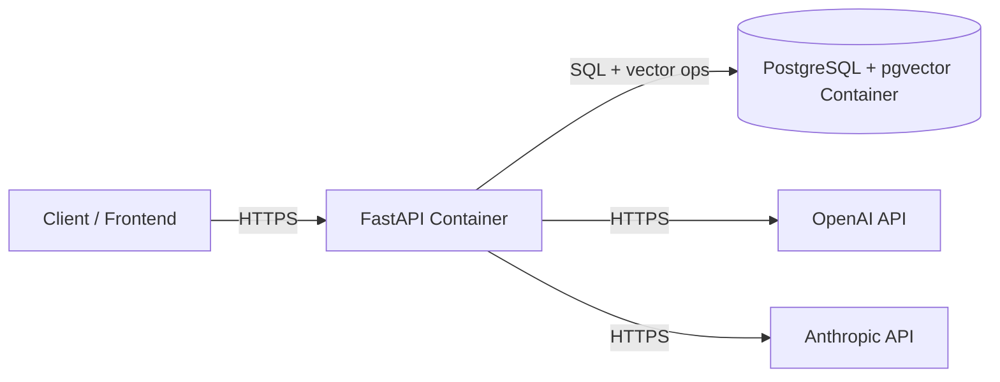

# Architecture

## Overview

PDF RAG Knowledge Assistant is a layered FastAPI application. Each layer has a
single responsibility and depends only on the layer below it:

```text
API layer (FastAPI routes)
   ↓
Orchestration (ingestion pipeline / retrieval+generation call in routes)
   ↓
Domain layers: ingestion | embeddings | vectorstore | retrieval | generation
   ↓
External services: OpenAI/Anthropic APIs, PostgreSQL+pgvector
```

## Component Responsibilities

| Component | Responsibility |
|---|---|
| `api/routes/documents.py` | Handle upload, validate file, delegate to ingestion pipeline |
| `api/routes/chat.py` | Handle question, delegate to retrieval + generation |
| `ingestion/pdf_loader.py` | Extract raw text per PDF page |
| `ingestion/chunker.py` | Split text into overlapping, embeddable chunks |
| `ingestion/pipeline.py` | Orchestrate load → chunk → embed → store |
| `embeddings/embedder.py` | Provide a configured embeddings client |
| `vectorstore/pgvector_store.py` | Own the PGVector connection/singleton |
| `retrieval/retriever.py` | Run similarity search, apply score threshold |
| `generation/prompt_builder.py` | Build the grounded system/user prompts |
| `generation/llm_client.py` | Call OpenAI or Anthropic with retry logic |

## Why this separation?

- **Testability:** retrieval and generation can be mocked independently in
  integration tests (see `tests/integration/test_chat_endpoint.py`) without
  standing up a real database or paying for LLM calls.
- **Swappability:** the vector store, embedding provider, and LLM provider are
  each isolated behind a small interface, so replacing pgvector with Qdrant,
  or OpenAI with a local embedding model, touches one file.
- **Clear failure boundaries:** each layer raises its own exception type
  (`DocumentProcessingError`, `RetrievalError`, `GenerationError`, ...),
  mapped centrally to HTTP status codes in `main.py`.

## Deployment Architecture



Both containers are defined in `docker-compose.yml` for local/single-host
deployment. See [`deployment.md`](deployment.md) for cloud deployment options.
