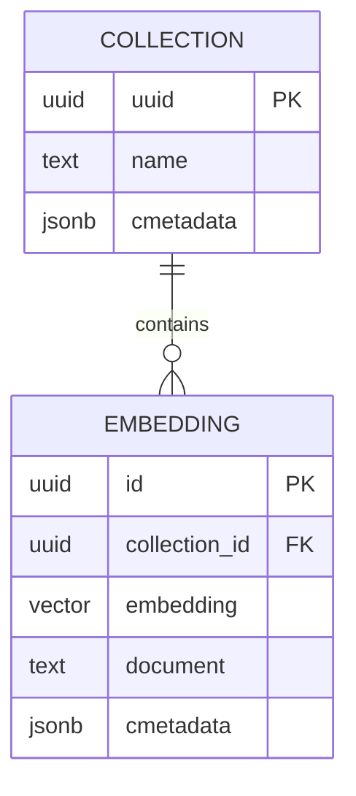

# Database Schema

The vector store is managed by `langchain-postgres`'s `PGVector` integration,
which provisions its schema automatically (no manual migration required for
v0.1). Conceptually:

## `langchain_pg_collection`
| Column | Type | Notes |
|---|---|---|
| `uuid` | UUID (PK) | |
| `name` | text | Matches `VECTOR_COLLECTION_NAME` (default `pdf_rag_documents`) |
| `cmetadata` | jsonb | Collection-level metadata |

## `langchain_pg_embedding`
| Column | Type | Notes |
|---|---|---|
| `id` | UUID (PK) | |
| `collection_id` | UUID (FK → `langchain_pg_collection.uuid`) | |
| `embedding` | vector(1536) | pgvector column, cosine similarity indexed |
| `document` | text | The chunk's raw text |
| `cmetadata` | jsonb | `{ chunk_id, source_file, page_number, chunk_index }` |

## Indexing

`pgvector` supports IVFFlat/HNSW indexes for approximate nearest-neighbor
search at scale. v0.1 relies on the default exact search suitable for small-
to-medium document collections; adding an HNSW index is a straightforward
follow-up once collection size grows (see Future Improvements / cost-analysis).

## ER Diagram

