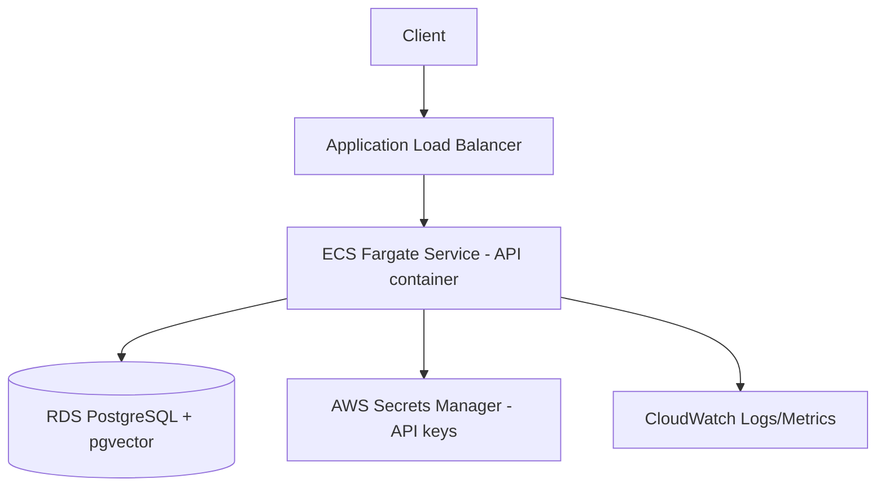

# Deployment

## Local (Docker Compose) — recommended for demos

```bash
docker compose up --build
```

Starts the API container and a `pgvector/pgvector:pg16` PostgreSQL container,
wired together via the compose network. The API is available at
`http://localhost:8000`.

## Health checks

The Dockerfile defines a `HEALTHCHECK` hitting `/health` every 30s. Any
orchestrator (Docker, ECS, Kubernetes) can use this endpoint directly for
liveness/readiness probing.

## Cloud deployment (AWS) — reference architecture

Not currently deployed, but the natural AWS mapping is:



- **ECS Fargate** runs the API container (built from the provided `Dockerfile`) — no
  server management, scales on request count.
- **RDS for PostgreSQL** (with the `vector` extension enabled) replaces the
  local Docker Postgres container.
- **Secrets Manager** stores `OPENAI_API_KEY` / `ANTHROPIC_API_KEY` / `API_KEY`,
  injected as environment variables into the ECS task definition.
- **CloudWatch** receives the structured JSON logs emitted by `structlog`.
- **Application Load Balancer** terminates TLS and performs health checks
  against `/health`.

This architecture is documented as a reference, not implemented — see
[Project Maturity](../README.md#project-maturity).

## Restart Strategy

`docker-compose.yml` sets `restart: unless-stopped` on both services so a
container crash is automatically recovered without manual intervention in a
single-host deployment.

## Environment Configuration Checklist

- [ ] `OPENAI_API_KEY` set (required)
- [ ] `ANTHROPIC_API_KEY` set (only if `PRIMARY_LLM_PROVIDER=anthropic`)
- [ ] `DATABASE_URL` points to a PostgreSQL instance with the `vector` extension
- [ ] `API_KEY` set for any non-local deployment
- [ ] `ALLOWED_ORIGINS` restricted to real frontend domain(s)
- [ ] `MAX_UPLOAD_SIZE_MB` and `RATE_LIMIT_PER_MINUTE` tuned for expected load
